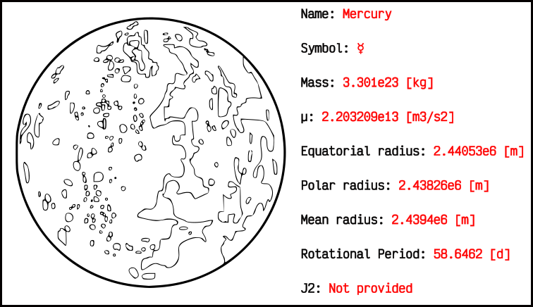

# Computer methods for astrodynamics 🚀📕 

This repository holds an open-source book that covers in detail all the topics
related with astrodynamics, orital-mechanics and astronomy. My intention
writing this book is to share all the knowledge that I have adquired during the
last years on all previous topics while making a small contribution to the
open-source community.

I would like to mantain a standard style along the book. All drawings and figures
should be embraced by a thick blakc line. Furthermore, drawings should be as
simple as they can: stylish fine black lines, elegant text if required and
no-coloured figures.

Once a new figure is designed, the *.svg and the *.png files with same file name
should be included in the `figs/` folder.

## What are the main topics of the book?

The book includes not only the most classical topics such us two-body problem,
three-body problem, relative motion, perturbations but also low-thrust
maneuvers, time scales and reference frames, main information on Solar System
bodies and more!

For example, you can check one of the beautiful images that this book provides.
In this case general information on planet Mercury is shown in the figure:

## How to contribute 🖥️

Contributions are always welcome, since writing a book alone is a tedious work.
New contributors should have a minimum knowledge on LaTeX or Inkscape, depending
if they want to write or add new figures/designs to the book.

Procedure to add your contribution is very simple:

1. Fork the repo and then clone it to your local machine
2. Create a new branch, add new content and push your changes
3. Finally open a new pull-request to the official repo
4. Once merged, celebrate your new contribution

Your changes will be added in furhter versions/releases of the book.

## LaTeX utilities 🎨

When writing this book, I found lots of really useful sources for LaTeX. This
section shows a collection of links that I usually make use of when writing
with TeX:

* [Latex Colors](https://latexcolor.com/)
